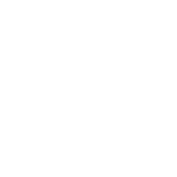
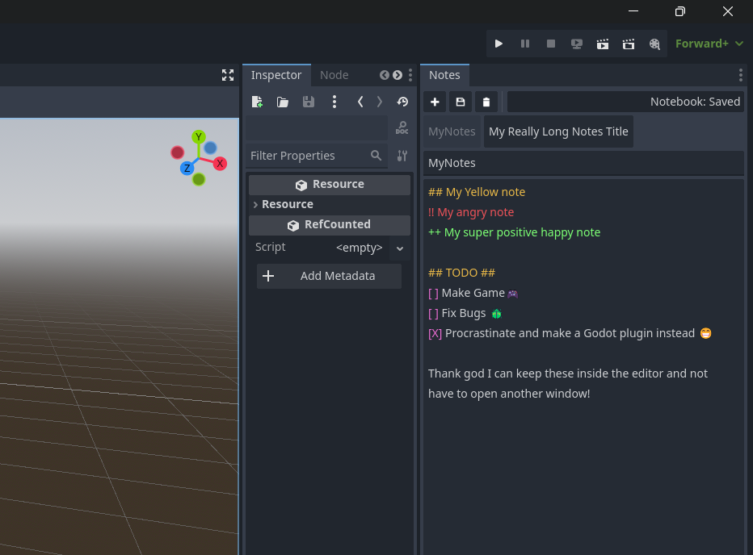

  	
  	<h1 align="center"> Godot Notebook</h1>
	<h3 align="center"> Keep your notes where your game is!</h3>

# Godot Notebook for Godot 4.4+
## Features
- Custom dock
- Write, view, and review notes without leaving the Godot editor
- Multiple pages with unique names and contents
- Simple syntax highlighting
	- ``##`` to highlight line yellow ⭐
	- ``++`` to highlight line green🟢
	- ``!!`` to highlight line red😡
	- ``[]`` to highlight your "checkbox" purple🟪

## Usage

1. Download a copy of the addon
2. Copy the ``addons`` folder from the downloaded project into the root directory of your project. The folder should reside at ``res://addons/godot_notebook``
3. In Godot, go to ``Project > Project Settings > Plugins `` and check the box for ``Godot Notebook``
4. The ``Notes`` dock will be automatically created and attached to your editor. 
[See the Godot documentation on managing docks.](https://docs.godotengine.org/en/stable/tutorials/editor/customizing_editor.html)

## License

Icons provided by [Kenney](https://kenney.nl/) under [Creative Commons CC1.0](https://creativecommons.org/publicdomain/zero/1.0/).

This project is licensed under the MIT license, see [LICENSE](LICENSE)
